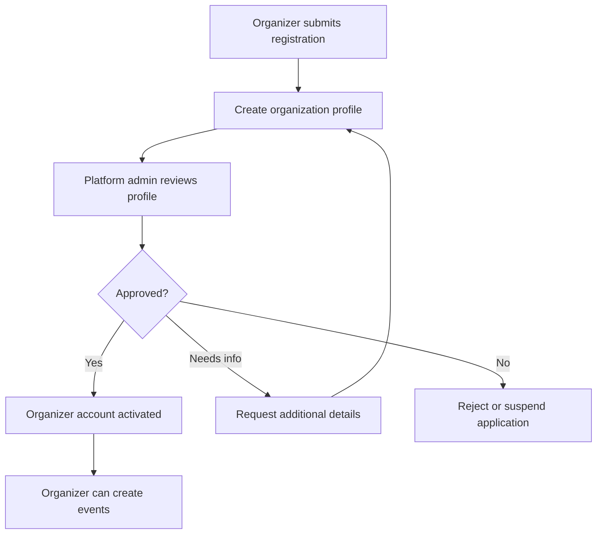
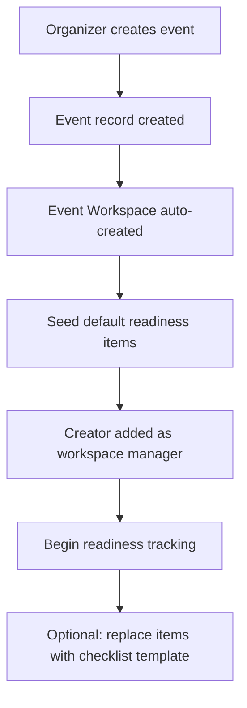
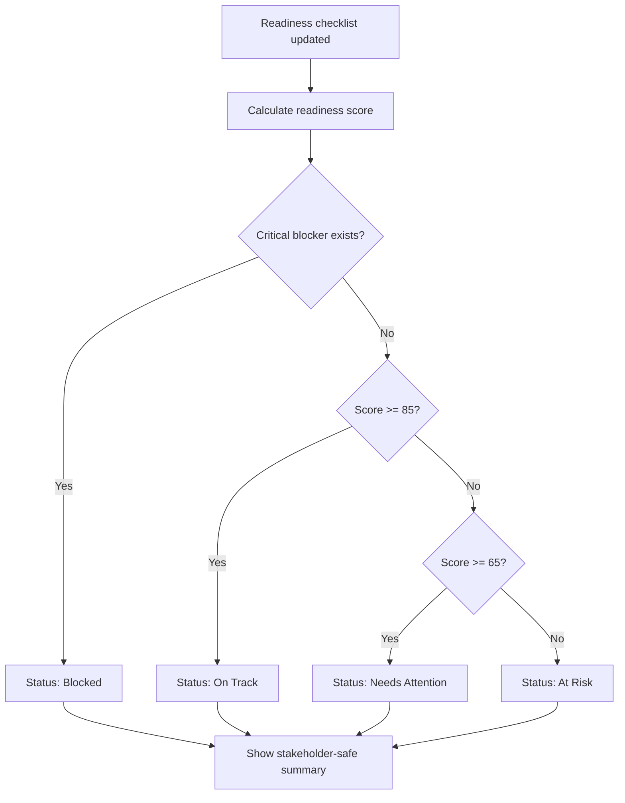
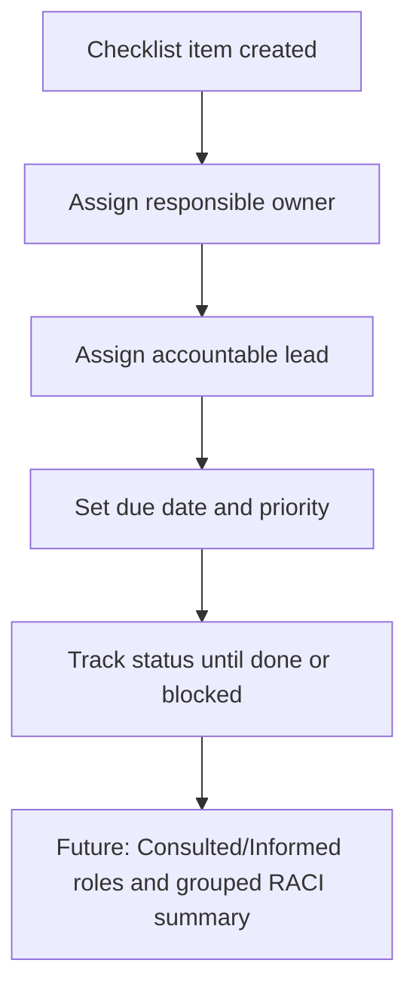
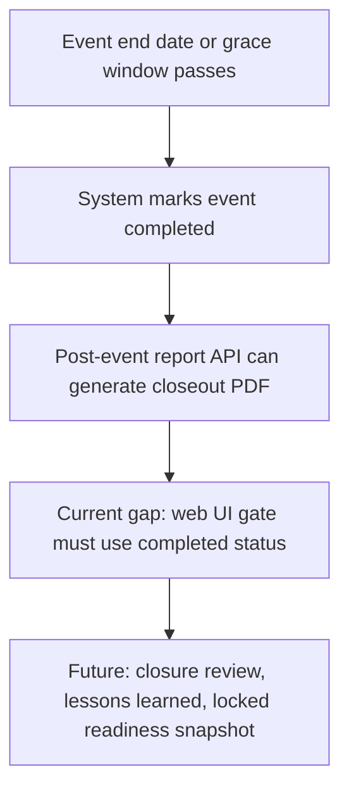

# Axon Tickets Event Workspace & Event Readiness Center

Master product, business, solution design, and backlog package.

Prepared for CEO review, product review, business review, solution architecture review, backlog grooming, and development planning.

## Current System Baseline

This package was re-audited against the current repository implementation on 2026-06-27. The codebase already includes ticketing, manual-payment registration, payment proof review, attendee QR check-in, organizer application and approval, event creation, event workspaces, readiness checklist templates, milestone tracking, weighted readiness scoring, share-safe readiness PDF export, post-event PDF generation, and admin analytics with sales, attendance, and registration funnel views.

The system is not yet a full event operating system. The largest remaining gaps are event-scoped workspace authorization, first-class event team management, true event role permissions, live stakeholder read-only access, explicit workspace closure with locked readiness snapshots, volunteer management, risk register, dependency graph, report snapshot history, and historical or predictive intelligence.

## 1. Executive Summary

Axon Tickets is expanding from a ticketing and registration platform into an event operating system focused on execution readiness, accountability, and stakeholder visibility. The core opportunity is not to compete head-on with Eventbrite on discovery, Ticket Fairy on marketing, or HelixPay on payments. Axon can own the operational layer that happens after an event is created and before the event is delivered.

The current initiative is Event Workspace & Event Readiness Center: a centralized, event-centric workspace where organizers can manage readiness checklists, milestones, ownership, blocked items, and stakeholder reporting. The MVP should remain intentionally small and validate whether organizers will replace spreadsheets with Axon as the source of truth for event execution.

The strongest recommendation is to launch an 8-week MVP with six tightly scoped capabilities only: Organizer Management, Event Workspace, Event Readiness Center, Task Ownership/RACI, lightweight Stakeholder Reporting, and a Post-Event Report Suite. Volunteer management, sponsor CRM, advanced risks, dependencies, automation, AI, analytics, and portfolio intelligence should be deferred.

The experience must stay simpler than the organizer's spreadsheet. If the Event Center feels visually busy or operationally heavy, adoption will collapse back to Excel.

## 2. Business Case

### Problem

Event organizers in the Philippines commonly coordinate event execution across spreadsheets, chat apps, email, cloud folders, and ticketing tools. This creates fragmented accountability, poor executive visibility, missed deliverables, and last-minute operational risk.

### Opportunity

Axon already has a natural event system of record through event creation, registration, ticketing, payments, QR validation, attendance, and reporting. The next strategic layer is operational readiness: what must be done, who owns it, what is blocked, and whether the event is ready.

### Business Value

| Outcome | Business impact |
|---|---|
| Higher organizer retention | Axon becomes useful before, during, and after ticket sales. |
| Stronger differentiation | Axon owns event execution, not only transactions. |
| Increased enterprise appeal | Share-safe reporting supports sponsors, executives, investors, and institutions without exposing sensitive contact or attendee data. |
| Expansion path | Readiness data becomes the foundation for analytics and event intelligence. |
| Reduced operational risk | Organizers can identify blockers before event day. |

### Cost of Inaction

If Axon stays focused only on ticketing and registration, organizers will continue using separate tools for execution. Axon will remain a transaction platform rather than the operational command center, making it easier for competitors or generic tools to own the daily workflow.

## 3. Competitive Analysis

| Platform | Current strength | Limitation | Axon opportunity |
|---|---|---|---|
| Eventbrite | Event discovery, marketplace reach, broad self-service tooling | Less focused on localized operational governance and readiness accountability | Position Axon as the operating layer for real-world event execution. |
| Ticket Fairy | Ticket sales acceleration, marketing, fan growth | Execution readiness is not the core product promise | Own post-sale readiness and team accountability. |
| HelixPay | Payments, commerce, transaction handling | Operational planning and stakeholder visibility are not central | Combine transaction visibility with readiness visibility. |
| Axon Tickets | Ticketing, registration, manual payment proof review, QR validation, attendance, organizer approval, event workspaces, readiness scoring, PDF reporting, admin analytics | Current scope partially addresses event execution fragmentation, but event-team permissions, live stakeholder access, closure snapshots, and advanced operations are not complete | Harden the Event Workspace into the single source of truth. |

## 4. Product Vision

Axon should become the Event Operating System for the Philippines: the platform where organizers create events, sell tickets, monitor registration and payments, coordinate operational readiness, assign accountable owners, generate share-safe progress updates, and learn from past event execution.

The product must remain event-centric. It should not become a generic project management system. Every capability should answer one of these questions:

- Is the event ready?
- What is incomplete?
- Who owns the next action?
- What is blocked?
- What must stakeholders know?

## 5. MVP Validation Assessment

### Is This Solving a Problem Worth Paying For?

Yes, if the buyer is an organizer, agency, institution, venue operator, or event owner that manages events with multiple contributors and external stakeholders. The strongest willingness to pay will come from teams that already feel pain from missed deliverables, spreadsheet drift, external reporting pressure, and executive pressure.

The product is less compelling for very small one-person events, simple meetups, or events where ticketing is the only meaningful workflow.

### Smallest MVP That Validates the Concept

The smallest MVP is a readiness workspace attached to each event, with checklist templates, owners, due dates, status, blocked flags, readiness score, a share-safe progress report, and a post-event report suite that covers the most important organizer and executive closeout needs. The current codebase implements much of this, but the role model, event-team assignment model, and post-event web gating still need correction before the MVP can be called complete.

### Highest Value MVP Modules

| Rank | Module | Why it matters |
|---|---|---|
| 1 | Event Readiness Center | Directly validates the core promise: know whether the event is ready. |
| 2 | Event Workspace | Creates the operating home for the event. |
| 3 | Task Ownership & RACI | Solves accountability gaps. |
| 4 | Stakeholder Reporting | Turns internal progress into safe external visibility without exposing internal workspaces. |
| 5 | Organizer Management | Required foundation for SaaS ownership and approval. |
| 6 | Post-Event Report Suite | Converts operational and ticketing data into a complete professional closeout package. |

### Lowest Complexity MVP Modules

| Rank | Module | Complexity view |
|---|---|---|
| 1 | Event Workspace overview | Mostly structured presentation of event operational state. |
| 2 | Checklist templates | Bounded workflow with reusable items. |
| 3 | Ownership assignment | Simple role and assignee model. |
| 4 | Downloadable stakeholder report | Narrow visibility surface because manual PDF sharing avoids external access. |
| 5 | Organizer approval | Simple but requires operational policy clarity. |

### Features To Postpone

Volunteer management, sponsor CRM/contact management, advanced risk management, advanced dependency management, workflow automation, budget management, AI recommendations, predictive readiness, benchmarking, event intelligence, and cross-event executive portfolio dashboards should be postponed.

### 8-Week Capacity Recommendation

Include:

- Organizer registration and approval.
- Organization profile.
- Event workspace creation from event creation.
- Event overview, team, timeline, and dashboard.
- Checklist templates.
- Checklist item ownership, due dates, status, blocked flag.
- Readiness score.
- Basic RACI on readiness items.
- Downloadable share-safe stakeholder progress report.
- Post-event report suite generation.

Exclude:

- Volunteer onboarding and attendance.
- Sponsor CRM/contact management.
- Full risk register.
- Advanced dependency graph.
- Workflow automation.
- AI and predictive scoring.
- Historical analytics.
- Budget and financial planning.

## 6. Lean MVP Recommendation

Build the MVP as a narrow operational readiness layer around existing event creation. Do not build a broad project management suite. The first release should answer: "Can an organizer replace their event readiness spreadsheet with Axon while still producing the reports they need?"

### MVP Scope Box

| In scope | Out of scope |
|---|---|
| Organizer account and approval | Full CRM |
| Organization profile | Sponsor CRM/contact storage |
| Event workspace | Generic project spaces |
| Checklist templates | Custom workflow builder |
| Ownership and due dates | Complex task dependencies |
| Blocked item tracking | Full escalation automation |
| Readiness score | Predictive scoring |
| Stakeholder reporting | Live collaboration portal for external parties |

### MVP Decision Gate

Proceed to Phase 2 only if at least 60 percent of pilot organizers actively use readiness tracking for more than one week and report reduced spreadsheet dependency.

## 7. Feature Assessment

| Feature area | MVP decision | Rationale |
|---|---|---|
| Organizer Registration & Verification | Include | Required for trusted multi-tenant onboarding. Keep verification manual/lightweight first. |
| Organizer Workspace | Include foundation only | Needed for organization and event ownership. Avoid broad admin complexity. |
| Event Workspace | Include | Core container for operational readiness. |
| Role-Based Access Management | Include basic | Required for trust and accountability. Avoid deeply custom permissions in MVP. |
| Volunteer Management | Defer | Valuable but not required to validate readiness. |
| Event Readiness Center | Include | Primary product bet. |
| RACI Management | Include lightweight | Needed for accountability. Avoid full enterprise RACI workflows. |
| Dependency Tracking | Include blocked flag only | Full dependency graph can wait. |
| Stakeholder Reporting | Include lightweight | Use share-safe downloadable progress reporting first; avoid broad external access surfaces. |
| Event Readiness Score | Include simple score | Makes readiness visible and executive-friendly. |
| Post-Event Report Suite | Include | Critical business deliverable for organizers and leadership after event completion; should cover commercial, operational, attendance, and demographic closeout needs. |

## 8. Event Workspace Design

The Event Workspace is the operational home automatically created for each event. It should organize execution state without replacing ticketing, payments, or reporting.

### Primary Workspace Views

| View | Purpose | Target MVP content | Current implementation state |
|---|---|---|---|
| Overview | Executive snapshot | Readiness score, open items, blocked items, upcoming milestones. | Implemented in event detail readiness banner and workspace summary. |
| Team | Ownership clarity | Event roles, assignees, contact visibility, RACI summary. | Partial. Responsible and Accountable assignment exists, but event team membership, invitations, contact visibility, and grouped RACI summary are not implemented. |
| Timeline | Near-term planning | Milestones, due dates, event day countdown. | Partial. Milestone CRUD and item due dates exist; no calendar view or formal countdown module. |
| Readiness Center | Operational control | Checklist categories, item statuses, blockers, owners. | Implemented. Templates, custom items, statuses, blocker panels, due dates, notes, and R/A assignment exist. |
| Stakeholder Report | External visibility | Share-safe progress summary and readiness indicators for manual sending or strictly view-only access. | PDF download implemented. Live strictly read-only stakeholder dashboard is not implemented. |

### Design Principles

- Event-first navigation.
- Minimal clicks to update status.
- Mobile-friendly checklist updates.
- Clear ownership on every operational item.
- Executive-readable readiness summary.
- Spreadsheet-simple interaction model with low visual clutter.
- High information value without dense or overwhelming screens.
- No generic boards unless anchored to event execution.

## 9. Event Readiness Center Design

The Event Readiness Center is the operational control room for an event. It combines checklist templates, milestones, blockers, ownership, and readiness scoring.

### Readiness Categories

| Category | Example items |
|---|---|
| Venue & Logistics | Venue confirmed, ingress/egress plan, seating plan, permits. |
| Ticketing & Registration | Ticket tiers checked, registration flow tested, QR validation plan. |
| Finance & Payments | Payment methods validated, reconciliation owner assigned. |
| Program & Production | Run of show, speakers/performers confirmed, technical checklist. |
| Staffing & Operations | Leads assigned, check-in team ready, briefing scheduled. |
| External Stakeholders | Stakeholder deliverables confirmed, progress update prepared, external reporting status checked. |
| Communications | Attendee reminders, emergency contact plan, public announcements. |
| Compliance & Safety | Permits, security plan, medical plan, incident owner. |

### MVP Statuses

| Status | Meaning |
|---|---|
| Not Started | Work has not begun. |
| In Progress | Work is actively being handled. |
| Blocked | Work cannot continue without intervention. |
| Done | Item is complete. |
| Not Applicable | Item does not apply and is excluded from scoring. |

## 10. Multi-Tenant Strategy

| Area | Target recommendation | Current implementation state |
|---|---|---|
| Organizer isolation | Each organizer belongs to an organization tenant. Organization data is isolated by tenant. | Partial. `Organization` and `OrganizationMember` exist, approved organizers can own events, and core admin event queries are organization-scoped for non-admin users. |
| Event isolation | Each event belongs to one organization. Event workspace data is scoped to that event. | Partial. Events have optional `organizationId` and workspaces have `eventId`, but workspace endpoints currently rely on approved-organizer access and do not consistently enforce event ownership per endpoint. |
| User membership | A user may belong to multiple organizations, but permissions are evaluated per organization and event. | Partial. Membership model supports multiple organizations, but the UI and workflows mostly create one owner membership and do not provide full multi-org switching or event-role permissions. |
| Admin visibility | Platform admins can view organizer and readiness health for support, compliance, and governance. | Partial. Admins can view organizer queues, events, analytics, and workspace readiness; no portfolio-level readiness health dashboard exists yet. |
| Stakeholder access | Stakeholders receive scoped read-only access to specific event visibility surfaces only. | Not implemented for live access. Manual PDF exports are the only stakeholder sharing path. |

## 11. Access Control Model

### Platform Roles

| Role | Purpose | Current implementation state |
|---|---|---|
| Platform Admin | Manages platform operations, organizer approvals, and support visibility. | Implemented through `isAdmin` and admin routes. |
| Platform Support | Views limited operational data for support cases. | Not implemented as a separate role. |
| Platform Finance | Views payment and reconciliation reports where authorized. | Not implemented as a separate role. |

### Organizer Roles

| Role | Purpose | Current implementation state |
|---|---|---|
| Organization Owner | Owns organization account, billing relationship, and user access. | Partially implemented. Registration creates an owner membership. |
| Organization Admin | Manages organization settings and event-level access. | Enum exists, but member management UI and permission behavior are not implemented. |
| Organization Member | Participates in assigned events. | Enum exists, but invitation, assignment, and event-role workflows are not implemented. |

### Event Roles

| Role | Primary responsibility | Current implementation state |
|---|---|---|
| Event Owner | Accountable for event outcome and final readiness. | Implicit through event creator / organization ownership, not a first-class event role. |
| Event Manager | Manages day-to-day event execution. | Not implemented as a distinct role. |
| Operations Lead | Owns logistics, venue, staffing, safety, and execution readiness. | Not implemented as a distinct role. |
| Finance Lead | Owns payment readiness and financial reporting. | Not implemented as a distinct role. |
| Registration Lead | Owns registration flow, ticketing setup, and check-in readiness. | Not implemented as a distinct role. |
| Volunteer Lead | Future owner for volunteer coordination. | Not implemented. |
| Check-In Team | Executes attendee validation and attendance flow. | Check-in page exists, but Check-In Team is not a distinct event role. |
| Viewer | Read-only internal access. | `WorkspaceRole.viewer` exists in schema, but read-only behavior is not enforced in the workspace UI. |
| Stakeholder Viewer | Read-only external/event-specific visibility when enabled. | Not implemented. |

## 12. Governance Model

| Governance area | Target MVP approach | Current implementation state |
|---|---|---|
| Organizer approval | Platform admin reviews organizer profile and approves activation. | Implemented, including pending/approved/rejected/suspended/revoked states and audit logs. |
| Event ownership | Every event must have one Event Owner. | Partial. Events have `createdById` and optional `organizationId`; Event Owner is not modeled as a separate event role. |
| Accountability | Every readiness item must have an owner before it can be counted as operationally controlled. | Partial. Unowned items are counted and surfaced, but unowned items are still valid and not blocked from scoring. |
| Auditability | Track who changed item status, owner, due date, and blocked state. | Partial. Workspace creation, item creation/deletion, template application, report generation, and item status changes are audited. Owner, accountable, due date, notes, blocker flag, milestone, and closure changes are not all audited consistently. |
| Stakeholder visibility | Event Owner controls whether a downloadable report or strictly read-only view is enabled. | Partial. Downloadable reports exist; live read-only stakeholder access and enable/disable controls do not. |
| Closure | Event can be marked closed after event date and final review. | Partial. Events auto-transition to `completed` after end date/grace window; no explicit workspace closure review or locked readiness snapshot exists. |

## 13. Data Ownership Model

| Data type | Owner | Current access notes |
|---|---|---|
| Organization profile | Organizer organization | Platform admins can review for approval and support; owner can view/update their own organization. |
| Event details | Organizer organization | Platform admins and approved organization members can access via admin routes that perform event access checks. |
| Readiness items | Event workspace | Stored per workspace/event. Current workspace endpoints need stronger event ownership enforcement. |
| RACI assignments | Event workspace | Responsible and Accountable fields exist. Consulted/Informed fields and event-team visibility rules do not. |
| Stakeholder reporting data | Event workspace | Share-safe PDFs are generated from limited Prisma selects. Live stakeholder data access does not exist. |
| Platform approval/audit records | Axon platform | Used for governance, support, and compliance; audit coverage is partial for readiness field changes. |

## 14. Readiness Framework

### Scoring Methodology

Recommended MVP formula:

Readiness Score = completed weighted points / applicable weighted points.

Do not count Not Applicable items. Treat Blocked items as zero completed points and show a blocker warning beside the score.

### Implemented Weights

| Item criticality | Weight |
|---|---:|
| Critical | 5 |
| High | 3 |
| Medium | 2 |
| Low | 1 |

The original product recommendation was Critical=3, Important=2, Standard=1. The current code uses the four-level priority model above. Product and engineering should either retain the implemented model or intentionally migrate the code and templates to the simpler three-level model.

### Implemented Readiness Thresholds

| Score | Status | Meaning |
|---:|---|---|
| 100 | Complete | All applicable weighted items are done. |
| 70-99 | On Track | Good progress, assuming no force blocker. |
| 40-69 | At Risk | Readiness gaps need active attention. |
| 0-39 | Needs Attention | Significant gaps remain. |
| Any score with a blocked critical item or blocked `isBlocker` item | Blocked | Executive attention required regardless of numeric score. |

### Executive Visibility

Executives currently see the score, status label, critical blockers, blocked item count, unowned count, overdue count, and upcoming milestones in the workspace/admin views. The share-safe report excludes internal notes, assignee PII, sponsor contacts, and attendee-level personal data. Top incomplete categories and owner completion summaries are not yet fully implemented as dashboard/report sections.

## 15. Stakeholder Visibility Framework

### Stakeholders Can See

In the current system, stakeholders can only see what organizers manually send as downloaded PDFs:

- Event name, date, venue, and status.
- Readiness score and status.
- Progress by readiness category.
- Upcoming milestones.
- Blocked item count and high-level blocker labels.
- Generated timestamp.
- Privacy-safe post-event report sections in the external export.

### Stakeholders Cannot Access

- Internal notes unless explicitly published.
- Organizer financial details.
- Attendee personal data.
- Sponsor contact records or relationship notes.
- Internal team contact details beyond designated owner names.
- Editable checklist or RACI controls.
- Other events in the organization.

There is no live stakeholder portal today, so there is no external dashboard authentication, token revocation, or live read-only data surface.

## 16. Role & Permission Matrix

| Capability | Current implementation state |
|---|---|
| View event workspace | Available to authenticated platform admins and approved organizers through admin/workspace routes. Needs per-event ownership enforcement on workspace endpoints. |
| Edit event workspace | Frontend currently sets `canEdit = true`; workspace edit endpoints do not enforce event role permissions. |
| Manage team roles | Not implemented. `WorkspaceMember` exists in schema but no full UI/workflow. |
| Manage readiness checklist | Implemented for users who can access the workspace route; role-specific limits are not enforced. |
| Update assigned items | Implemented technically for accessible items; assigned-only restrictions are not enforced. |
| Mark item blocked | Implemented through item status/blocker fields; role-specific restrictions are not enforced. |
| View stakeholder dashboard/report | Downloadable report exists. Live stakeholder dashboard does not. |
| Generate stakeholder report | Implemented for users with workspace route access. Event-owner-only generation is not enforced. |
| Generate post-event report | API implemented; web UI currently gates on `complete` instead of enum value `completed`. |
| Close event workspace | Not implemented. |

## 17. Process Workflows

### Workflow Summary

| Workflow | MVP? | Primary owner |
|---|---|---|
| Organizer Registration | Yes | Organization Owner |
| Organizer Approval | Yes | Platform Admin |
| Event Creation | Yes | Event Owner |
| Event Workspace Creation | Yes | System/Platform |
| Volunteer Onboarding | No, Phase 2 | Volunteer Lead |
| Checklist Management | Yes | Event Manager |
| Task Assignment | Yes | Event Manager |
| RACI Assignment | Partial | Event Owner/Event Manager |
| Dependency Management | Blocked status only | Event Manager |
| Risk Management | No, Phase 2 | Operations Lead |
| Stakeholder Reporting | PDF only | Event Owner |
| Executive Reporting | PDF/dashboard summary only | Event Owner |
| Post-Event Reporting | API implemented, UI gate needs fix | Event Owner |
| Event Readiness Review | Yes | Event Owner/Event Manager |
| Event Closure | Partial | Event Owner |

## 18. Process Flow Diagrams

### Organizer Registration & Approval

### Event Creation To Workspace

### Readiness Review

### RACI And Task Assignment

### Event Closure

## 19. Existing Axon Impact Analysis

| Module | Current state | Future state | Business justification | Priority | Migration considerations |
|---|---|---|---|---|---|
| Event Creation | Event setup with ticket tiers, payment methods, agenda/FAQ/sponsor metadata, organization ownership, and workspace auto-create | Harden workspace creation observability and existing-event backfill | Turns event setup into operational kickoff | Must Have | Existing events may need optional workspace creation. |
| Organizer Dashboard | Registrations, payments, event analytics, check-in, and workspace readiness views | Add event-team, role-based workspace access, and closure workflow | Keeps organizers returning before event day | Must Have | Preserve current sales/payment KPIs. |
| Admin Dashboard | Platform monitoring, organizer approval, event analytics, registration review, readiness banner/workspace access | Add readiness portfolio health and support-limited visibility | Enables governance and support intervention | Should Have for MVP admin ops | Avoid exposing sensitive event internals unnecessarily. |
| Reporting | Registration/payment analytics, readiness PDF, post-event PDF API, external export API | Fix post-event UI gate; add report history/snapshots and advanced reports | Supports organizers, executives, and institutional buyers without exposing attendee-level personal data | Must Have | Keep PII inside the platform and enforce no-PII query boundaries. |
| User Management | Basic users, admin flag, organization owner membership, approved-organizer access | Add organization member invitations, event roles, workspace roles, and per-event permission checks | Enables accountability and scoped access | Must Have | Existing users need default organization/event membership mapping. |

## 20. Product Backlog

Backlog is separated into MVP, Phase 2, Phase 3, and Future Vision. Priorities use Must Have, Should Have, Could Have, and Won't Have This Phase.

## 21. MVP Epics

| Epic | Business value |
|---|---|
| MVP-E1 Organizer Management | Establish trusted organizer ownership and SaaS tenant structure. |
| MVP-E2 Event Workspace | Give every event a centralized operational home. |
| MVP-E3 Event Readiness Center | Validate the core value proposition of readiness monitoring. |
| MVP-E4 Task Ownership & RACI | Create clear accountability for execution work. |
| MVP-E5 Stakeholder Reporting | Provide share-safe progress visibility for sponsors, investors, and executives. |
| MVP-E6 Post-Event Report Suite | Produce a complete post-event reporting package without exposing attendee-level personal data. |

## 22. MVP Features

| Epic | Feature | Priority | Dev Status |
|---|---|---|---|
| Organizer Management | Organizer registration | Must Have | ✅ Complete |
| Organizer Management | Organization profile | Must Have | ✅ Complete |
| Organizer Management | Admin approval workflow | Must Have | ✅ Complete |
| Event Workspace | Auto-create workspace from event | Must Have | ✅ Complete |
| Event Workspace | Event overview dashboard | Must Have | 🔶 Partial - readiness dashboard exists; true viewer/read-only role behavior is not wired yet |
| Event Workspace | Event team and timeline | Must Have | 🔶 Partial - milestones/timeline exist; event team management is limited to creator/admin assignment pool |
| Event Readiness Center | Checklist templates | Must Have | ✅ Complete |
| Event Readiness Center | Item status and blocked tracking | Must Have | ✅ Complete |
| Event Readiness Center | Readiness scoring | Must Have | ✅ Complete |
| Task Ownership & RACI | Assign owner, accountable lead, due date | Must Have | 🔶 Partial - responsible/accountable and due date exist; assignable users are not full event-team members yet |
| Task Ownership & RACI | RACI view | Should Have | 🔶 Partial - R and A exist inline; C/I and grouped RACI summary are deferred |
| Stakeholder Reporting | Downloadable progress report | Must Have | ✅ Complete |
| Stakeholder Reporting | Strictly read-only dashboard view | Could Have | ⬜ Not Yet Built - no tokenized/scoped live stakeholder route yet |
| Post-Event Report Suite | Executive summary report | Must Have | 🔶 Partial - API PDF exists; web completion gate uses `complete` instead of `completed` |
| Post-Event Report Suite | Sales and revenue report | Must Have | 🔶 Partial - API PDF exists; web completion gate uses `complete` instead of `completed` |
| Post-Event Report Suite | Registration report | Must Have | 🔶 Partial - API PDF exists; web completion gate uses `complete` instead of `completed` |
| Post-Event Report Suite | Attendance and check-in report | Must Have | 🔶 Partial - API PDF exists; web completion gate uses `complete` instead of `completed` |
| Post-Event Report Suite | Operations and blockers report | Must Have | 🔶 Partial - API PDF exists; web completion gate uses `complete` instead of `completed` |
| Post-Event Report Suite | Demographics report with aggregated charts only | Must Have | 🔶 Partial - API PDF exists; web completion gate uses `complete` instead of `completed` |
| Post-Event Report Suite | Privacy-safe shareable export | Must Have | 🔶 Partial - external export exists in API; web completion gate uses `complete` instead of `completed` |

### Current Implementation Audit

Status was checked against the current repository implementation on 2026-06-27.

| Area | Current state | Future work needed |
|---|---|---|
| Organizer registration | Done - `/become-organizer` form, `/organizations` API, `Organization` and `OrganizationMember` models, validation DTOs, audit/email hooks. | Add richer KYC document upload only if business policy requires it. |
| Organizer approval workflow | Done - admin organizer queue, approve/reject/suspend/revoke/reinstate API actions, approval actor/timestamp fields, audit logs. | Tighten reinstatement policy and expose clearer reason history if needed. |
| Organization tenant foundation | Partial - events can belong to an organization; non-admin event lists are scoped to approved organization membership. | Add full multi-organization switching, member invitations, role management UI, and tenant-aware workspace guards. |
| Event workspace lifecycle | Done - `EventsService.create` calls `ensureWorkspace`; manual "Enable Workspace" path exists; default readiness items are seeded. | Consider surfacing failures from fire-and-forget workspace creation through admin health checks. |
| Workspace overview | Partial - event detail page and workspace page show readiness score, blocker counts, unowned/overdue counts, and milestones. | Replace `canEdit = true` and broad approved-organizer workspace access with event-role based read/edit behavior. |
| Event team | Partial - `WorkspaceMember` model exists and assignees can be selected from admins plus event creator. | Build event team invite/member UI, workspace role editing, and assignment from organization/event members. |
| Timeline/milestones | Done - workspace milestones can be created, marked done/upcoming, deleted, and included in summaries/reports. | Add automatic overdue status updates and calendar-style timeline if needed. |
| Checklist templates | Done - conference, concert, community, and general templates are implemented and can replace workspace items. | Align template categories with the product package's canonical readiness categories if product wants stricter consistency. |
| Checklist status/blockers | Done - items support `open`, `in_progress`, `done`, `blocked`, `not_applicable`, blocker flag, notes, due dates, and blocked lists. | Rename `open` to "Not Started" at the API/type layer only if consistency matters outside UI labels. |
| Readiness scoring | Done - weighted score, non-applicable exclusion, critical/blocker override, and dashboard labels exist. | Current document now matches the implemented four-level scoring model. |
| Ownership and RACI | Partial - items support responsible user, accountable user, due date, unowned flag, and overdue flag. | Add Consulted/Informed fields only if still desired; build grouped RACI summary and enforce event-team membership. |
| Stakeholder progress report | Done - share-safe PDF endpoint excludes attendee PII, internal notes, and assignee PII; UI download button exists. | Add report snapshot history if recurring stakeholder updates matter. |
| Live stakeholder read-only dashboard | None - no public/tokenized stakeholder route, scoped auth guard, token model, invite flow, or revocation mechanism found. | Implement `StakeholderAccessToken`, scoped read-only API, stakeholder route, expiry/revocation, and audit logging. |
| Post-event report suite usable flow | Partial - API PDF generator includes executive summary, revenue, registration, attendance/check-in, operations/blockers, and demographics. | Fix web status gate from `complete` to `completed`; add end-to-end verification that completed events can download both internal and external PDFs. |
| Privacy-safe post-event export usable flow | Partial - API external export suppresses small demographic groups and avoids attendee names/emails/phones/QR tokens. | Same UI gate fix as post-event report; add tests around small cohort suppression and no-PII query boundaries. |
| Event closure | Partial - events auto-complete after end date/grace window; no explicit workspace closure workflow or locked readiness snapshot exists. | Add close workspace action, closure review, lessons learned, and immutable readiness snapshot. |
| Auditability | Partial - organizer and workspace create/status/delete/template/report actions are audited. | Audit owner, accountable, due date, blocker flag, milestone create/update/delete, and workspace closure changes consistently. |

### Recommended Report Coverage Model

| Report output | Primary audience | Core contents | Privacy rule | Delivery phase |
|---|---|---|---|---|
| Executive Summary Report | Event Owner, executives | Event overview, topline outcome, readiness result, major wins, major issues, final status | Summary-safe only | MVP |
| Sales and Revenue Report | Event Owner, finance lead, executives | Ticket sales by tier, revenue totals, payment method mix, refunds if applicable, sales trend | No attendee-level records | MVP |
| Registration Report | Event Owner, registration lead | Registration totals, registration timeline, approval or payment status mix, historical registration curve | Aggregated counts only | MVP |
| Attendance and Check-In Report | Event Owner, operations lead | Attendance totals, check-in rate, no-show estimate, check-in timing distribution | Aggregated counts only | MVP |
| Operations and Blockers Report | Event Owner, operations lead, executives | Final blockers, unresolved items, incident summary, overdue work, lessons captured | No sensitive internal notes in external export | MVP |
| Demographics Report | Event Owner, executives, institutional buyers | Current API covers aggregated company/organization and job-title/function groups; ticket mix is covered in sales/revenue. Age and geography charts are not currently collected/generated. | Suppress or group tiny cohorts in external export | MVP partial |
| Readiness and Delivery Report | Event Owner, PMO-style internal leads | Final readiness score, category completion, milestone delivery, owner completion summary | Internal or share-safe mode | Phase 2 |
| Marketing and Conversion Report | Event Owner, marketing lead | Admin funnel analytics currently exist; formal downloadable marketing/conversion report with campaign and promo-code attribution is not implemented. | No attendee-level journey export | Phase 2 partial foundation |
| Stakeholder Delivery Report | Event Owner, external partners | Deliverables completed, reporting commitments met, visibility assets delivered | No sponsor contacts or relationship notes | Phase 2 |
| Historical Event Comparison Report | Organization Owner, leadership | Comparison versus prior events for registrations, attendance, readiness, blockers, and delivery quality | Cross-event views must stay tenant-safe and aggregated | Phase 3 |

## 23. MVP User Stories

### MVP-E1 Organizer Management

#### Story OM-01: Organizer Registration `✅ Complete`

As a new organizer, I want to register my organization, so that I can manage events under a verified business profile.

Business value: Creates a trusted SaaS onboarding path and supports tenant ownership.

Acceptance criteria:

- Given a new organizer has valid contact and organization information, when they submit registration, then an organizer profile is created with pending approval status.
- Given required fields are missing, when the organizer submits the form, then the system prevents submission and identifies missing fields.
- Given registration is submitted, when a platform admin views pending organizers, then the organizer appears in the approval queue.

Dependencies: User account foundation, organization profile fields.

Priority: Must Have.

#### Story OM-02: Organizer Approval `✅ Complete`

As a platform admin, I want to approve or reject organizer applications, so that Axon controls who can operate events on the platform.

Business value: Reduces fraud, protects platform quality, and supports governance.

Acceptance criteria:

- Given an organizer is pending approval, when an admin approves them, then the organizer can create events.
- Given an organizer is rejected, when they attempt to create an event, then access is denied with a clear status message.
- Given an approval decision is made, when the record is viewed later, then the decision, actor, and timestamp are visible to authorized admins.

Dependencies: Organizer registration.

Priority: Must Have.

### MVP-E2 Event Workspace

#### Story EW-01: Auto-Create Event Workspace `✅ Complete`

As an Event Owner, I want an Event Workspace to be created when I create an event, so that operational planning starts immediately.

Business value: Makes readiness a default part of event operations instead of a separate setup step.

Acceptance criteria:

- Given an approved organizer creates an event, when the event is saved, then an Event Workspace is automatically created.
- Given a workspace is created, when the Event Owner opens the event, then workspace navigation is available.
- Given an existing event has no workspace, when an authorized owner enables readiness, then a workspace is created for that event.

Dependencies: Event creation, organizer approval.

Priority: Must Have.

#### Story EW-02: Event Overview Dashboard `🔶 Partial - readiness summary implemented; role-based read-only behavior still needs wiring`

As an Event Manager, I want to see the event's readiness summary, so that I know what needs attention first.

Business value: Reduces time spent reconciling scattered tools and improves operational focus.

Acceptance criteria:

- Given readiness items exist, when the dashboard loads, then it shows readiness score, open items, blocked items, and upcoming milestones.
- Given there are critical blockers, when the dashboard loads, then the blocked status is visually prominent.
- Given a user lacks edit access, when they view the dashboard, then they can see permitted information without edit controls.

Dependencies: Workspace creation, readiness items.

Priority: Must Have.

### MVP-E3 Event Readiness Center

#### Story RC-01: Apply Checklist Template `✅ Complete`

As an Event Manager, I want to apply a readiness checklist template, so that I do not start operational planning from scratch.

Business value: Drives adoption by replacing the organizer's spreadsheet with an immediate useful structure.

Acceptance criteria:

- Given a new workspace exists, when the template is applied, then readiness categories and checklist items are created.
- Given an item does not apply, when it is marked Not Applicable, then it is excluded from readiness scoring.
- Given a template is applied, when the readiness center opens, then categories are grouped and easy to scan.

Dependencies: Event Workspace.

Priority: Must Have.

#### Story RC-02: Track Checklist Status And Blockers `✅ Complete`

As an Operations Lead, I want to update item status and mark blockers, so that readiness reflects operational reality.

Business value: Makes risks visible before event day.

Acceptance criteria:

- Given an item is assigned to me, when I change its status, then the readiness center reflects the new status.
- Given an item is blocked, when I mark it blocked, then it appears in the blocked items list.
- Given a blocked item exists, when readiness is summarized, then the dashboard highlights the blocker count.

Dependencies: Checklist template, role access.

Priority: Must Have.

#### Story RC-03: Readiness Score `✅ Complete`

As an Event Owner, I want a readiness score, so that I can quickly judge whether the event is on track.

Business value: Creates an executive-friendly signal and a differentiator from generic spreadsheets.

Acceptance criteria:

- Given applicable checklist items have statuses and weights, when readiness is calculated, then the score reflects completed weighted points divided by applicable weighted points.
- Given a critical item is blocked, when the score is displayed, then the event shows Blocked even if the numeric score is high.
- Given items are updated, when the dashboard is refreshed, then the readiness score updates accordingly.

Dependencies: Checklist statuses, item weights.

Priority: Must Have.

### MVP-E4 Task Ownership & RACI

#### Story TR-01: Assign Ownership And Due Dates `🔶 Partial - R/A and due dates implemented; event-team assignment model still limited`

As an Event Manager, I want to assign owners and due dates to readiness items, so that every item has accountable follow-through.

Business value: Converts checklists from passive lists into accountable execution tools.

Acceptance criteria:

- Given a checklist item exists, when an authorized user assigns an owner and due date, then both appear on the item.
- Given an item has no owner, when readiness is reviewed, then it is flagged as unowned.
- Given an item is overdue, when the dashboard loads, then it appears in upcoming or overdue work.

Dependencies: Event team roles.

Priority: Must Have.

#### Story TR-02: Lightweight RACI `🔶 Partial - R and A implemented; C/I and grouped RACI summary deferred`

As an Event Owner, I want to identify responsible and accountable people for key items, so that ownership is clear.

Business value: Reduces ambiguity among organizers, leads, sponsors, and stakeholders.

Acceptance criteria:

- Given a readiness item exists, when RACI is edited, then Responsible and Accountable fields can be assigned.
- Given Consulted or Informed roles are optional, when they are blank, then the item remains valid.
- Given a user views the RACI summary, when items are grouped by owner, then they can see who owns what.

Dependencies: Team roles, checklist items.

Priority: Should Have.

### MVP-E5 Stakeholder Reporting

#### Story SD-01: Downloadable Stakeholder Progress Report `✅ Complete`

As an Event Owner, I want to generate a share-safe stakeholder progress report, so that I can communicate status without exposing my internal workspace or sensitive data.

Business value: Supports sponsors, executives, investors, and institutional stakeholders with low manual reporting effort and stronger data control.

Acceptance criteria:

- Given stakeholder reporting is enabled, when an Event Owner generates a progress report, then it includes event summary, readiness score, category progress, blockers summary, and milestones.
- Given a progress report is generated, when it is shared externally, then it contains no attendee PII, sponsor contact records, internal notes, or editable controls.
- Given an organizer prefers manual sharing, when the report is downloaded, then they can send it outside the platform without granting external system access.

Dependencies: Readiness score, event overview.

Priority: Must Have.

#### Story SD-02: Optional Strictly Read-Only Stakeholder View `⬜ Not Yet Built - PDF download is covered by SD-01; live token-based stakeholder view is not implemented. Requires: StakeholderToken model, scoped auth guard, invite flow, revocation mechanism.`

As an Event Owner, I want any stakeholder-facing live view to be strictly read-only, so that external audiences can never change operational data.

Business value: Enables professional visibility while protecting sensitive operational data.

Acceptance criteria:

- Given live stakeholder viewing is disabled, when an external user attempts access, then the dashboard is unavailable.
- Given a stakeholder has approved access, when they open the dashboard, then they only see the assigned event in read-only mode.
- Given access is revoked, when the stakeholder attempts to reload, then access is denied.

Dependencies: Stakeholder reporting, access control.

Priority: Could Have.

### MVP-E6 Post-Event Report Suite

#### Story PR-01: Generate Post-Event Report Suite `🔶 Partial - API report generator implemented; web download gate uses complete instead of completed`

As an Event Owner, I want Axon to generate a post-event report suite, so that I can close the event with a professional summary without exporting raw personal data.

Business value: Delivers a concrete organizer outcome after the event and keeps sensitive data inside the platform.

Acceptance criteria:

- Given an event is completed, when the post-event report suite is generated, then it includes an Executive Summary Report, Sales and Revenue Report, Registration Report, Attendance and Check-In Report, Operations and Blockers Report, and a Demographics Report.
- Given the report suite includes registration history and demographics, when it is rendered, then it uses aggregated summaries and charts rather than attendee-level personal records.
- Given the report suite includes commercial reporting, when it is generated, then it includes ticket sales by tier, registration trends, attendance totals, check-in rates, and blocker summaries.
- Given attendee personal data exists in the platform, when the post-event report suite is generated, then names, emails, phone numbers, exact addresses, and other specific personal data are excluded.
- Given the report suite is shared externally, when a recipient reads it, then they can understand event performance without being able to identify individual registrants.

Dependencies: Ticketing data, registration data, readiness data, reporting layer.

Priority: Must Have.

#### Story PR-02: Privacy-Safe External Report Export `🔶 Partial - external API export implemented; web download gate uses complete instead of completed`

As an Event Owner, I want a privacy-safe export version of the post-event report suite, so that I can share outcomes externally without leaking protected or commercially sensitive data.

Business value: Preserves organizer trust and reduces data leakage risk while still supporting executive and stakeholder reporting.

Acceptance criteria:

- Given an organizer exports the external version of the report suite, when it is generated, then attendee-level personal data is excluded.
- Given sponsor-related reporting appears in the suite, when it is generated, then no sponsor contact records or relationship notes are included.
- Given demographic data appears in the suite, when counts are too small to safely isolate a group, when the export is produced, then the data is grouped or suppressed to reduce re-identification risk.
- Given the external export is produced, when reviewed by an organizer, then it is suitable for manual sending to executives, partners, or stakeholders.

Dependencies: Post-event report suite generation, access control, privacy rules.

Priority: Must Have.

## 24. MVP Acceptance Criteria Summary

The MVP is acceptable when:

- An organizer can register and be approved.
- An approved organizer can create an event.
- Event creation creates or enables an Event Workspace.
- A readiness checklist template can be applied.
- Readiness items can be assigned owners, due dates, statuses, and blocked flags.
- Readiness score is calculated using applicable weighted items.
- Critical blockers override the score with a blocked status.
- Event Owner and Manager can review readiness, blockers, and milestones.
- Organizers can generate a share-safe stakeholder progress report without exposing sensitive internal data.
- Axon can generate a post-event report suite with executive summary, sales, registration, attendance, blockers, and demographic graphs without exposing attendee-level personal data.
- Pilot organizers can reduce or retire their event readiness spreadsheet for at least one event.

Current acceptance gaps before declaring the full MVP complete:

- Replace broad approved-organizer workspace access and the `canEdit = true` frontend shortcut with organization/event/workspace role checks.
- Build event team membership and assignment beyond platform admins plus event creator.
- Decide whether to align code to the scoring spec or update the product spec to match the implemented scoring model.
- Fix post-event report web gating to use the `completed` event status.
- Add live stakeholder read-only access only if the Could Have item remains desired for MVP.
- Add explicit workspace closure and locked readiness snapshot if closure remains a Must Have governance item.

## 25. Phase 2 Backlog: Event Operations

### Epic P2-E1 Volunteer Management

Business value: Supports staffing and event-day execution once readiness MVP is validated.

#### Story VM-01: Volunteer Roster

As a Volunteer Lead, I want to maintain a volunteer roster, so that event staffing is visible in the workspace.

Business value: Reduces disconnected volunteer spreadsheets.

Acceptance criteria:

- Given an event workspace exists, when volunteers are added, then they appear in the volunteer roster.
- Given a volunteer has an assignment, when the roster is viewed, then their role and shift are visible.
- Given a volunteer is removed, when the roster is viewed, then they no longer appear as active.

Dependencies: Event Workspace.

Priority: Should Have.

#### Story VM-02: Volunteer Attendance

As a Volunteer Lead, I want to track volunteer attendance, so that I know whether staffing plans were fulfilled.

Business value: Improves event-day operations and post-event evaluation.

Acceptance criteria:

- Given volunteers are rostered, when attendance is marked, then attendance status is recorded.
- Given attendance is incomplete, when event closure begins, then the system flags missing attendance records.
- Given attendance data exists, when reporting is viewed, then attendance summary is visible.

Dependencies: Volunteer roster.

Priority: Should Have.

### Epic P2-E2 Risk And Dependency Management

Business value: Adds structured operational control for complex events.

#### Story RD-01: Risk Register

As an Operations Lead, I want to maintain a risk register, so that potential event issues are visible and owned.

Business value: Improves proactive event governance.

Acceptance criteria:

- Given a risk is created, when severity and owner are assigned, then it appears in the risk register.
- Given a risk is high severity, when dashboard summaries load, then it appears in priority risk indicators.
- Given a risk is resolved, when marked closed, then it no longer counts as active.

Dependencies: Event Workspace, owner assignment.

Priority: Should Have.

#### Story RD-02: Dependency Tracking

As an Event Manager, I want to track dependencies between readiness items, so that blocked work is easier to manage.

Business value: Helps teams understand prerequisites and escalation needs.

Acceptance criteria:

- Given two readiness items exist, when one is set as a dependency, then the relationship is visible.
- Given a prerequisite is incomplete, when dependent work is viewed, then it shows dependency risk.
- Given a dependency is completed, when dependent work is viewed, then the blocker indication is removed if no other blocker exists.

Dependencies: Readiness items.

Priority: Should Have.

### Epic P2-E3 Advanced Reporting

Business value: Converts readiness activity into professional reporting.

#### Story AR-01: Operational Readiness Report

As an Event Owner, I want to generate a readiness report, so that I can update stakeholders without manual formatting.

Business value: Saves organizer time and supports executive communication.

Acceptance criteria:

- Given readiness data exists, when a report is generated, then it includes score, progress, blockers, milestones, and owner summary.
- Given stakeholder-safe mode is selected, when the report is generated, then sensitive data is excluded.
- Given reports are generated over time, when viewed later, then previous snapshots remain available.

Dependencies: Readiness Center, Stakeholder Reporting.

Priority: Should Have.

#### Story AR-02: Readiness And Delivery Report

As an Event Owner, I want a readiness and delivery report, so that I can formally review what was completed, delayed, or missed.

Business value: Strengthens operational learning and creates a reusable event closeout standard.

Acceptance criteria:

- Given an event is closed, when the report is generated, then it includes final readiness score, readiness by category, milestones completed or missed, overdue items, and closure summary.
- Given ownership data exists, when the report is generated, then it includes owner-based completion summaries without exposing sensitive attendee data.
- Given the report is reviewed after closure, when the organizer uses it, then they can identify execution gaps to improve the next event.

Dependencies: Readiness Center, RACI data, event closure flow.

Priority: Should Have.

#### Story AR-03: Marketing And Conversion Report

As an Event Owner, I want a marketing and conversion report, so that I can understand how registrations and sales were influenced by channels and campaigns.

Business value: Helps organizers improve future event acquisition and revenue performance.

Acceptance criteria:

- Given registration source or campaign data exists, when the report is generated, then it includes registrations by source, conversion summaries, and promo or discount performance.
- Given campaign data is incomplete, when the report is generated, then the report clearly identifies which sections are unavailable.
- Given the report is shared internally, when viewed by leadership, then it supports decision-making without exposing attendee-level personal data.

Dependencies: Registration funnel data, promo data, reporting layer.

Priority: Should Have.

#### Story AR-04: Stakeholder Delivery Report

As an Event Owner, I want a stakeholder delivery report, so that I can show what visibility commitments and external deliverables were fulfilled without storing sponsor contacts in the platform.

Business value: Supports organizer professionalism while respecting organizer control over sponsor relationships.

Acceptance criteria:

- Given stakeholder-facing commitments exist, when the report is generated, then it summarizes completed external deliverables and reporting milestones.
- Given sponsor contact data is not stored in the platform, when the report is generated, then it references deliverable status only and not sponsor contact records.
- Given the report is shared, when external parties receive it, then it provides outcome visibility without exposing internal notes or attendee-level personal data.

Dependencies: Stakeholder reporting, event delivery tracking.

Priority: Should Have.

## 26. Phase 3 Backlog: Operational Intelligence

### Epic P3-E1 Historical Analytics

Business value: Helps organizers learn from past events and improve future execution.

#### Story HA-01: Historical Readiness Trends

As an Organization Owner, I want to compare readiness trends across past events, so that I can improve planning quality.

Business value: Turns operational history into organizer insight.

Acceptance criteria:

- Given multiple closed events exist, when analytics are viewed, then readiness trends are shown over time.
- Given event categories differ, when filtering analytics, then comparable event types can be selected.
- Given historical blockers exist, when trends are viewed, then recurring blocker categories are visible.

Dependencies: Event closure snapshots.

Priority: Could Have.

### Epic P3-E2 Benchmarks

Business value: Creates differentiated intelligence for organizers and Axon.

#### Story BM-01: Event Type Benchmarks

As an Event Owner, I want to compare my event readiness against similar event types, so that I can understand whether my planning is healthy.

Business value: Supports premium insights and future event intelligence.

Acceptance criteria:

- Given enough comparable events exist, when benchmarks are viewed, then anonymized readiness comparisons are shown.
- Given insufficient data exists, when benchmarks are requested, then the system explains that benchmarks are not yet available.
- Given benchmark data is shown, when viewed, then no organizer-specific competitor data is exposed.

Dependencies: Historical analytics, privacy controls.

Priority: Could Have.

### Epic P3-E3 Organizer Insights

Business value: Helps organizers improve recurring operational behavior.

#### Story OI-01: Recurring Gap Insights

As an Organization Owner, I want to see recurring readiness gaps, so that I can improve how my team plans events.

Business value: Supports retention by making Axon useful beyond individual events.

Acceptance criteria:

- Given closed events have readiness history, when insights are viewed, then recurring late categories are identified.
- Given a category frequently blocks readiness, when insights are viewed, then it appears as a recommended improvement area.
- Given insights are unavailable, when the page is viewed, then a clear empty state explains what data is needed.

Dependencies: Historical analytics.

Priority: Could Have.

## 27. Future Vision Backlog: Event Intelligence

### Epic F1 AI-Assisted Recommendations

Business value: Moves Axon from operational tracking to proactive event intelligence.

#### Story AI-01: Readiness Recommendations

As an Event Manager, I want recommended next actions, so that I can focus on the work most likely to improve readiness.

Business value: Reduces planning burden and differentiates Axon as an intelligent operations platform.

Acceptance criteria:

- Given readiness gaps exist, when recommendations are generated, then the top suggested actions are based on blockers, due dates, and criticality.
- Given a recommendation is shown, when the user views it, then the reason for the recommendation is understandable.
- Given sensitive data is involved, when recommendations are generated, then stakeholder-restricted data is not exposed.

Dependencies: Strong readiness data, usage history, governance model.

Priority: Future.

### Epic F2 Predictive Readiness

Business value: Forecasts event execution risk before it becomes visible manually.

#### Story PR-01: Event Readiness Forecast

As an Event Owner, I want a readiness forecast, so that I can know whether the event is likely to be ready by event day.

Business value: Creates high-value intelligence from Axon's operational data.

Acceptance criteria:

- Given sufficient historical and current readiness data exists, when forecast is viewed, then projected readiness by event day is shown.
- Given confidence is low, when forecast is displayed, then the system communicates low confidence clearly.
- Given a forecast changes materially, when viewed, then the drivers of change are summarized.

Dependencies: Historical analytics, benchmark data, model governance.

Priority: Future.

### Epic F3 Event Performance Forecasting

Business value: Links ticketing, attendance, and readiness into a broader event intelligence product.

#### Story PF-01: Operational Performance Forecast

As an executive stakeholder, I want a forecast of operational and attendance readiness, so that I can make better decisions before event day.

Business value: Supports enterprise and institutional positioning.

Acceptance criteria:

- Given ticketing, registration, and readiness data exist, when forecast is viewed, then operational and attendance indicators are shown together.
- Given forecast data is incomplete, when viewed, then missing inputs are identified.
- Given stakeholder mode is used, when forecast is shared, then sensitive internal details remain hidden.

Dependencies: Mature data platform, reporting governance, event intelligence models.

Priority: Future.

## 28. Roadmap

| Phase | Theme | Goals | Included capabilities | Decision gate |
|---|---|---|---|---|
| Phase 1 | Foundation | Validate centralized workspace, readiness, accountability, simple reporting, and low-friction usability | Organizer onboarding, Event Workspace, Event Readiness Center, RACI, Stakeholder Reporting, Post-Event Report Suite | Pilot organizers reduce spreadsheet dependency and actively update readiness. |
| Phase 2 | Event Operations | Expand into event execution operations | Volunteers, risk register, dependency management, escalations, advanced reporting | Organizers request operational depth after MVP adoption. |
| Phase 3 | Operational Intelligence | Turn closed event history into insight | Historical analytics, benchmarks, organizer insights | Enough events exist for meaningful trends and anonymized comparisons. |
| Phase 4 | Event Intelligence | Predict and recommend | Predictive readiness, AI recommendations, performance forecasting | Data quality, governance, and adoption justify intelligent automation. |

## 29. Risks

| Risk | Impact | Mitigation |
|---|---|---|
| Product becomes generic project management | Dilutes Axon's event-centric differentiation | Keep all objects tied to event execution, readiness, milestones, or stakeholder visibility. |
| MVP too broad | Slower release and unclear validation | Ship only the readiness workflow needed to replace spreadsheets. |
| UI feels heavier than Excel | Organizers abandon the product | Keep screens visually simple, reduce clutter, and optimize for fast repeated updates. |
| Readiness score lacks trust | Users ignore the score | Use transparent formula, visible blockers, and category-level progress. |
| Stakeholder data exposure | Loss of trust | Strict read-only scoped visibility and sensitive data exclusions. |
| Organizer onboarding friction | Low activation | Keep verification lightweight at first, with manual admin support. |
| Role complexity | Confusing UX | Use default roles and simple event-level permissions in MVP. |
| Low checklist relevance | Users return to spreadsheets | Start with practical templates and allow Not Applicable status. |

## 30. Success Metrics

### MVP Adoption Metrics

- Percent of approved organizers creating at least one Event Workspace.
- Percent of events with checklist template applied.
- Percent of readiness items with assigned owners.
- Weekly active workspace usage per event.
- Number of status updates per active event.

### Value Metrics

- Percent of pilot organizers reporting reduced spreadsheet dependency.
- Average readiness score improvement over event lifecycle.
- Number of blockers identified before event day.
- Stakeholder report generations per event.
- Post-event report suite generations per completed event.
- External privacy-safe report exports per completed event.
- Organizer satisfaction with readiness visibility.

### Business Metrics

- Organizer retention.
- Events per organizer.
- Conversion from ticketing-only usage to workspace usage.
- Willingness to pay for operations module.
- Expansion opportunities for institutions, agencies, and recurring organizers.

## 31. Recommended MVP Scope

Already built or partially built:

- Organizer registration and approval.
- Organization profile.
- Automatic Event Workspace creation.
- Event overview and readiness dashboard.
- Milestones and checklist due dates.
- Readiness checklist templates.
- Checklist statuses, due dates, owners, blocked flags, Not Applicable.
- Weighted readiness score with critical blocker override.
- Lightweight RACI for Responsible and Accountable only.
- Downloadable stakeholder progress report.
- Post-event report suite API generation.
- Basic governance and audit trail for organizer approval and selected readiness actions.

Still required before declaring MVP complete:

- Event-scoped workspace authorization on all workspace endpoints.
- Real event team membership, invitations, and assignment from organization/event members.
- Frontend role checks instead of `canEdit = true`.
- Post-event report UI gate fix from `complete` to `completed`.
- Explicit workspace closure and locked readiness snapshot if closure remains in MVP scope.
- Audit coverage for owner/accountable/due date/blocker/milestone/closure changes.

The MVP post-event report suite should include:

| Report | Required coverage |
|---|---|
| Executive Summary Report | Implemented in API: event outcome, final readiness state, top wins, top issues. Closeout/lessons workflow is not implemented. |
| Sales and Revenue Report | Implemented in API: sales totals, revenue totals, ticket mix, payment method summary. |
| Registration Report | Implemented in API: registration totals, status mix, daily registration timeline. |
| Attendance and Check-In Report | Implemented in API: attendance totals, check-in rate, no-show count, event-day arrival pattern. |
| Operations and Blockers Report | Implemented in API: final readiness, completed item count, unresolved blockers, blocked items, milestone completion. Incident and lessons-captured fields are not implemented. |
| Demographics Report | Implemented in API for aggregated company/organization and job-title/function groups. Age/geography charts are not implemented. |
| Privacy-Safe External Export | Implemented in API with no attendee PII and small-group suppression; web UI gate needs the `completed` status fix. |

Do not build:

- Volunteer management.
- Sponsor CRM/contact storage.
- Full dependency graph.
- Full risk register.
- Workflow automation.
- AI recommendations.
- Benchmarking.
- Budgeting.
- Portfolio-level executive dashboard.

## 32. Recommended Future Scope

Phase 2 should add volunteer operations, risk register, dependency tracking, escalations, readiness and delivery reporting, marketing and conversion reporting, and stakeholder delivery reporting. Phase 3 should add historical analytics, benchmarks, and organizer insights. Phase 4 should add predictive readiness, AI-assisted recommendations, and event performance forecasting only after Axon has sufficient high-quality operational data. Sponsor contact management should remain outside the platform unless organizer trust and commercial demand clearly change.

## 33. Implementation Status

Status key: ✅ Complete · 🔶 Partial · ⬜ Not Yet Built

### MVP Epic and Story Status

| Epic | Story | Status | Notes |
|---|---|---|---|
| MVP-E1 Organizer Management | OM-01: Organizer Registration | ✅ Complete | `POST /organizations` — registration creates organization with pending approval status |
| MVP-E1 Organizer Management | OM-02: Organizer Approval | ✅ Complete | `PATCH /admin/organizers/:id/approve`, `reject`, `suspend`, `revoke`, and `reinstate` with audit trail |
| MVP-E2 Event Workspace | EW-01: Auto-Create Event Workspace | ✅ Complete | `ensureWorkspace` idempotent call on event creation; workspace auto-provisioned |
| MVP-E2 Event Workspace | EW-02: Event Overview Dashboard | 🔶 Partial | Readiness summary exists with score, blockers, overdue count, milestones, and unowned count. Missing role-based read-only behavior and event-scoped workspace authorization. |
| MVP-E3 Event Readiness Center | RC-01: Apply Checklist Template | ✅ Complete | Multiple categorised templates; replaces all items atomically; Not Applicable excluded from score |
| MVP-E3 Event Readiness Center | RC-02: Track Checklist Status And Blockers | ✅ Complete | Five statuses (Not Started, In Progress, Blocked, Done, N/A); isBlocker flag; critical blocker panel |
| MVP-E3 Event Readiness Center | RC-03: Readiness Score | ✅ Complete | Weighted score (critical=5, high=3, medium=2, low=1); force-Blocked override for blocked critical/isBlocker items; implemented thresholds are Complete=100, On Track>=70, At Risk>=40, Needs Attention<40. |
| MVP-E4 Task Ownership & RACI | TR-01: Assign Ownership And Due Dates | 🔶 Partial | `assignedToId`, `accountableId`, and `dueDate` exist; overdue and unowned counts exist. Assignment pool is limited and not backed by full event-team membership. |
| MVP-E4 Task Ownership & RACI | TR-02: Lightweight RACI | 🔶 Partial | Responsible (`assignedToId`) and Accountable (`accountableId`) fields exist. Consulted/Informed and grouped RACI summary are not implemented. |
| MVP-E5 Stakeholder Reporting | SD-01: Downloadable Stakeholder Progress Report | ✅ Complete | Privacy-safe PDF via `GET /workspace/report`; privacy enforced at Prisma select layer; audit logged |
| MVP-E5 Stakeholder Reporting | SD-02: Strictly Read-Only Stakeholder View | ⬜ Not Yet Built | Manual share via PDF belongs to SD-01. Live stakeholder URL, token auth, scoped read-only endpoint, and revocation are not implemented. |
| MVP-E6 Post-Event Report Suite | PR-01: Generate Post-Event Report Suite | 🔶 Partial | API generates a six-section PDF. Web button currently checks `complete` instead of enum value `completed`, so completed-event downloads may stay disabled in UI. |
| MVP-E6 Post-Event Report Suite | PR-02: Privacy-Safe External Report Export | 🔶 Partial | API supports `?export=external` with small-group suppression and no attendee PII. Same web status-gate issue remains. |

### Phase 2+ Status

| Area | Status | Notes |
|---|---|---|
| Volunteer management | ⬜ Not Yet Built | No volunteer roster, shifts, assignments, or volunteer attendance model/UI. |
| Risk register | ⬜ Not Yet Built | No risk model, risk dashboard, severity, owner, or resolution workflow. |
| Dependency graph | ⬜ Not Yet Built | Only item `blocked` status exists; no item-to-item dependency model. |
| Advanced readiness/delivery reports | 🔶 Partial | Readiness PDF and post-event operations section exist; no report history, closure summary, owner completion summary, or snapshot archive. |
| Marketing/conversion reporting | 🔶 Partial | Admin registration funnel analytics exist; downloadable marketing/conversion report, campaign source mix, promo code reporting, and attribution are not implemented. |
| Stakeholder delivery report | ⬜ Not Yet Built | No stakeholder commitments/deliverables model or report. |
| Historical analytics and benchmarks | ⬜ Not Yet Built | No closed-workspace snapshots, cross-event readiness trends, benchmark cohorts, or recurring gap insights. |
| AI, predictive readiness, performance forecasting | ⬜ Not Yet Built | No recommendation, prediction, benchmark, or model-governance subsystem. |

### Permission and Security Gaps

The current workspace implementation should not be described as permission-complete. `AdminGuard` allows platform admins and approved organizers. Core admin event routes often call `assertEventAccess`, but workspace routes do not consistently enforce that the requesting approved organizer belongs to the event's organization. The frontend workspace page also sets `canEdit = true`. These are product and security completion gaps for MVP-grade event-scoped workspace permissions.

### SD-02 Required Components

| Component | Status |
|---|---|
| `StakeholderToken` Prisma model (event-scoped, expirable) | ⬜ Not built |
| Scoped token generation endpoint | ⬜ Not built |
| `StakeholderGuard` (validates token, scopes to one event read-only) | ⬜ Not built |
| Read-only workspace summary endpoint behind `StakeholderGuard` | ⬜ Not built |
| Public-facing stakeholder view page (`/share/[token]`) | ⬜ Not built |
| Token revocation endpoint | ⬜ Not built |

Recommended to scope as two stories in Phase 2: SD-02a (token generation and storage) and SD-02b (read-only stakeholder view page).

## 34. Final CTO Recommendation

Proceed with the initiative, but keep the first release disciplined. The product thesis is strong because it extends Axon's existing event lifecycle from transactions into operations. The mistake to avoid is building a broad project management tool or a sponsor CRM that organizers do not trust. The winning product is smaller, sharper, and more event-specific: one workspace per event, one readiness score, clear ownership, visible blockers, lightweight stakeholder reporting, and a post-event report suite that covers the organizer's real closeout needs without ever exposing attendee-level personal data.

The MVP should be treated as a validation product. Its job is to prove that organizers will use Axon as their event execution source of truth and reduce spreadsheet dependency. If that behavior appears in pilots, Axon should continue into Phase 2 and gradually build toward Event Intelligence.
